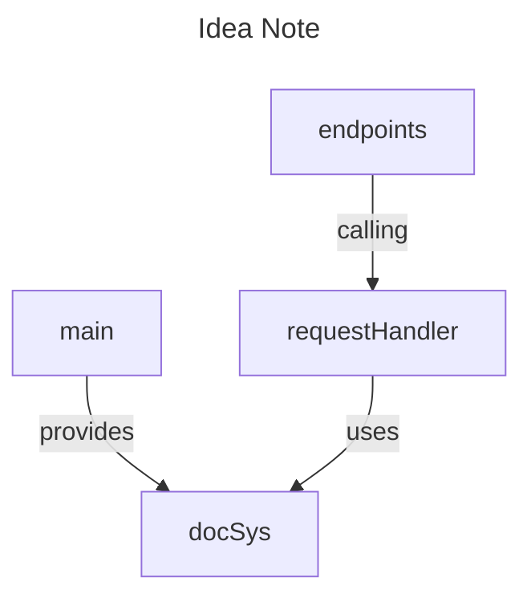

```mermaid
---
title: Idea Note
---
graph TB
main --provides-->docSys  
endpoints --calling--> requestHandler
requestHandler --uses-->docSys 
```

der requestHandler stellt die funktionen für die endpoints 
dabei extrahiert der rh gegebenfalls parameter und eingaben um sie korrekt an das docsys weiter zugeben. 
ebenso